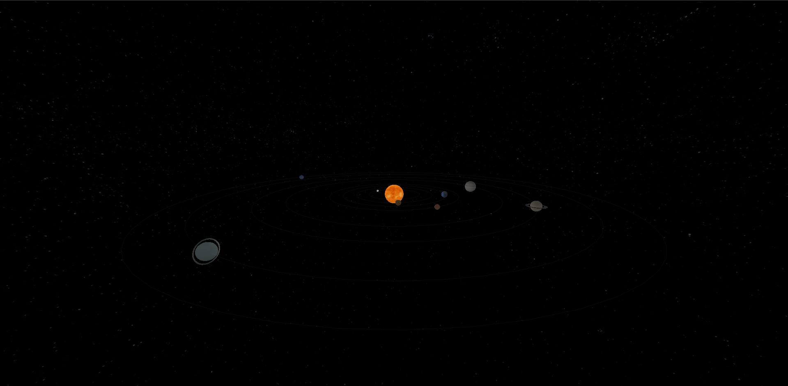

# Cosmos

A remake of the solar system created using Three.js. 

In this simple simulation, the solar system was re-designed using Three.js as an interface to WEBGL.The user is able to interact with the sun, and its surroundings by controlling the cursor. The purpose of this project is to explore and visualize the fascinating world of space and planets. I wanted to create an interactive experience that captures the beauty and complexity of celestial bodies and their orbits.

  

View complete [three.js](https://threejs.org/) documentation.
